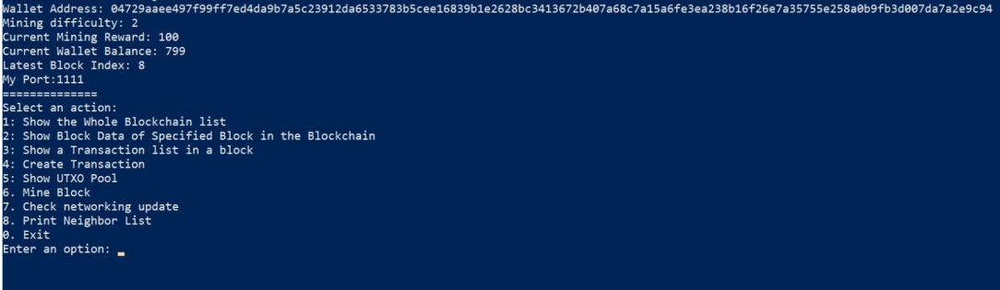
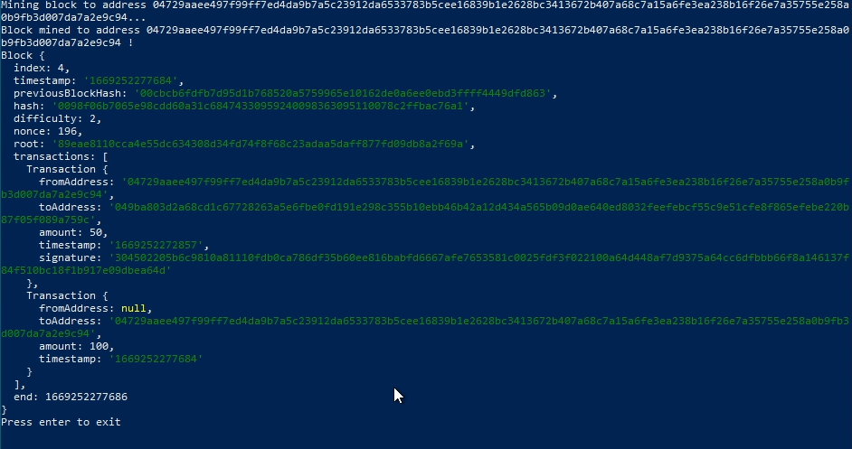
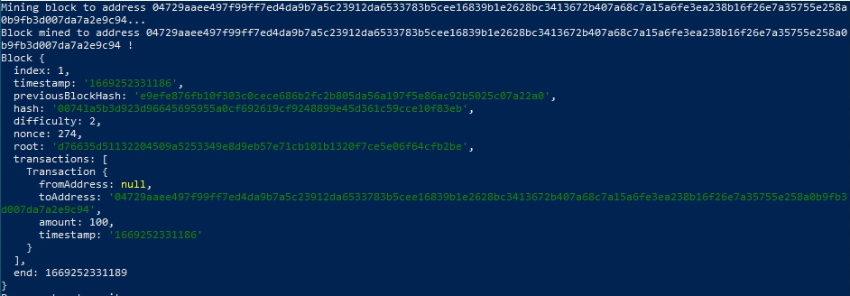
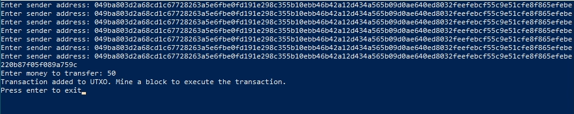
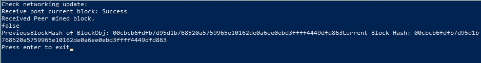
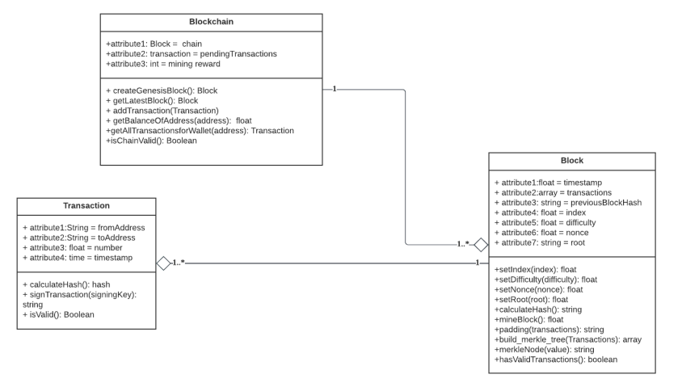

# UTXO Blockchain System in Node.JS

## Overview
This is a coin system implemented in Node.JS. Each program is a "node" in this blockchain. Each node has the ability to:

- Mine a coin according to the **mining difficulty**
- Maintain each transaction nodes in a **merkle tree**
- Re-calculate the mining diffulty with the **proof of work algorithm**
- Verify each transaction block using **pay-to-public-key-hash (P2PKH) architecture**
- Broadcast new blocks when one is mined and get the blocks from the
other nodes with the **express.js protocol**
- Store currently mined blocks in **local MongoDB database**.

The program uses a command line interface. This is how the main menu looks:

## Dependencies
- Node.JS 18.12.1 or above
- NPM package installer
- MongoDB Community Server 6.0.3 or above (The database is **local** and is used to serve as a platform to store local blocks. It does not store blocks of other nodes.=)

## Block Structure

- index: The index of the current block in the chain
- timestamp: The creation time of this block
- previousBlockHash: The **SHA-256** hash of the current block. The block hashes hte previous block's hash, timestamp, nounce, index, difficulty and merkle root.
- difficulty: The mining diffulty
- root: The merkle root hash of all nodes in the merkle tree for validating the blockchain
- transactions: Includes a list of transaction blocks, each blocks has the *fromAddress* (sender address), *toAddress* (receiver address), *amount* (transaction amount) and *timestamp* (time of transaction)

## Usage Demo

Assume the following use case with Client A and Client B. Client A will mine a new block and send money to Client B.
### 1. Client A: Mine a block

In the main menu, press 6 to mine a new block. The time of mining depends on the mining difficulty and the number of blocks in the chain. By default, it is set as 2 but can be modified. After a block is mined, the block structure of the newly mined block is displayed:

### 2. Client A: Add a transaction block and send money to another client

In the main menu, press 4 to create a new transaction. Enter the sender address and money to transfer. The transaction will be added to the transaction block.

### 3. Client A: Mine a new block again to put the pending transactions in the new block.

Press 6 again to mine a new block. A new block has to be mined in order to add the pending transactions to the transaction blocks in the new block, hence to be added in the blockchain and broadcasted to other nodes.

### 4. Client B: Refresh the network and check the balance.

Press 7 to refresh the network in client B and receive broadcasted nodes from client A. The blockchain should be updated and the money sent from client A should be received.

## Class Diagram

## Functions in the Main Menu

### Show the whole blockchain list
Shows a list of blocks in the blockchain of the current node.

### Show block data of specified block in the blockchain
Allows user to input the hash of a block and view its block strucutre.

### Show a transaction list in a block
Allows user to input the hash of a block and retreive the transaction list in that block.

### Create a transaction
Allows user to send money to another node with an address.

### Show UTXO pool
Shows the list of pending transaction not yet added to the blockchain.

### Mine block
Mines a block and adds the mining reward to the current node. 

### Check networking update
Refreshes the network connection so as to receive other node's broadcast, in case a node is broadcasting a new blockchain.
